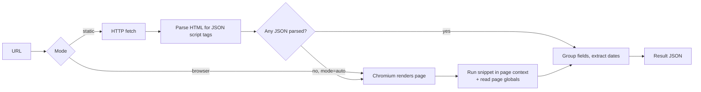

# JSON Scraper

Extract embedded JSON from any public web page — `application/ld+json`, `application/json`, and JavaScript globals such as `__NEXT_DATA__` — then browse every field and copy its key or XPath.

Comes with a web UI, a command-line tool, and a small HTTP API.

---

## Why this exists

In DevTools you can grab a page's structured data with one line:

```js
JSON.parse(document.querySelector('script[type="application/ld+json"]').textContent);
```

That snippet can't be turned into a web app, because a browser is not allowed to read another site's HTML (the same-origin policy). JSON Scraper runs the equivalent logic **on the server**, where that restriction doesn't apply — and for JavaScript-rendered pages it runs the snippet inside a real Chromium page.

It also fixes three practical problems with the one-liner:

| Problem | What this tool does |
| --- | --- |
| `querySelector` returns only the **first** match | Collects every matching block from both selectors |
| `JSON.parse` chokes on CDATA, HTML comments, BOM, trailing `;` | Sanitizes each block before parsing, and reports failures instead of dropping them |
| Many sites have **no** JSON script tag at all | In browser mode, also reads page globals (`__NEXT_DATA__`, `__NUXT__`, Zoho's `var jobs`, …) |

---

## Requirements

- **Node.js 18 or newer** (built and tested on Node 22). Check with `node -v`.
- About 300 MB of disk space if you want browser mode (downloads Chromium).

---

## Getting started (beginners start here)

### Step 1 — Get the code

```bash
git clone <your-repo-url>
cd json-scraper
```

### Step 2 — Install dependencies

```bash
npm install
```

### Step 3 — Install Chromium (one time)

Needed only for **browser mode**, which handles JavaScript-rendered sites. Skip it if you only want plain HTTP fetching.

```bash
npx playwright install chromium
```

### Step 4 — Start the app

```bash
npm start
```

Open **http://localhost:3000** in your browser. Press `Ctrl+C` in the terminal to stop it.

### Step 5 — Run your first scrape

1. Click the **Wikipedia** sample chip (or paste any article URL into the box).
2. Leave **Mode** on *Auto*.
3. Click **Parse page**.

You should see a status line, a stat row, and the parsed JSON.

### Step 6 — Read the results

| Where | What it shows |
| --- | --- |
| **Stat row** | HTTP status, which mode was used, how many blocks parsed, elapsed time |
| **JSON blocks** tab (left) | The full JSON payload, syntax-highlighted and collapsible |
| **Key values** pane (right) | Every distinct field, one row each |
| **Raw response** tab | The complete API response, with Copy and Download |

In the **Key values** pane:

- Repeated array items are collapsed — `title ×40` means that field occurs 40 times.
- Type in the filter box to narrow by key or path.
- Hover a row and click **Key** to copy the field name, or **XPath** to copy its path (e.g. `$.posts[*].title`).
- **All keys** / **All XPaths** copy the whole list at once.

### Step 7 — If nothing is found

Switch **Mode** to **Browser** and try again. Many job boards and single-page apps only build their JSON after JavaScript runs.

---

## Choosing a mode

| Mode | How it works | Typical time | Use for |
| --- | --- | --- | --- |
| **Static** | Plain HTTP fetch, HTML parsed on the server | 1–3s | Server-rendered pages: news, blogs, Wikipedia |
| **Browser** | Chromium renders the page, then the snippet runs in the page context | 4–20s | Single-page apps: Workable, Greenhouse, Lever, Zoho |
| **Auto** *(default)* | Static first, falls back to browser only if nothing parsed | 1–3s, or longer on fallback | General day-to-day use |

> **Tip:** Auto pays for a failed static attempt before falling back. For sites you already know are JavaScript-rendered, pick **Browser** directly.

---

## Using the command line

```bash
npm run cli -- https://en.wikipedia.org/wiki/JSON
```

Everything after `--` is passed to the tool.

```bash
npm run cli -- <url> --mode browser        # force browser mode
npm run cli -- <url> --json                # full raw result
npm run cli -- <url> --dates-only          # only date fields
npm run cli -- <url> --out results         # save result to a folder
npm run cli -- --input urls.txt --out results --concurrency 5
```

`urls.txt` is one URL per line; lines starting with `#` are ignored. Batch mode writes one JSON file per URL plus a `summary.json`, and one failure never stops the run.

### All CLI options

| Flag | Description |
| --- | --- |
| `--mode <auto\|static\|browser>` | Fetch strategy (default `auto`) |
| `--json` | Print the full raw result |
| `--dates-only` | Print only extracted date fields |
| `--out <dir\|file>` | Write result(s) to disk as JSON |
| `--input <file>` | Newline-separated list of URLs |
| `--concurrency <n>` | Parallel pages in batch mode (default 3) |
| `--timeout <ms>` | Request / navigation timeout |
| `--wait <ms>` | Extra wait after load, browser mode |
| `--headful` | Show the browser window |
| `--fresh` | Bypass the in-memory cache |
| `--allow-private` | Permit localhost / private-network targets |
| `-h`, `--help` | Show help |

---

## Using the HTTP API

```bash
curl -X POST http://localhost:3000/api/scrape \
  -H 'Content-Type: application/json' \
  -d '{"url":"https://en.wikipedia.org/wiki/JSON","mode":"auto"}'
```

**Request fields:** `url` (required), `mode` (`auto` | `static` | `browser`), `waitMs` (0–15000), `noCache` (boolean).

**Response:**

```jsonc
{
  "url": "…", "finalUrl": "…", "status": 200,
  "mode": "browser", "cached": false,
  "attempts": [ { "mode": "static", "status": 200, "blocks": 0 } ],
  "elapsedMs": 4723, "bytes": 138204,
  "blockCount": 1, "parsedCount": 1,
  "blocks": [
    { "label": "window.jobs", "source": "js-global", "bytes": 21063, "parsed": true, "data": {} }
  ],
  "dates": [ { "xpath": "$.datePosted", "key": "datePosted", "iso": "2026-08-04T00:00:00.000Z" } ],
  "primaryDate": {}
}
```

Errors return `{ "error": "…" }` with status 400 (bad input or blocked target), 405 (wrong method), or 429 (rate limited).

**Other endpoints**

| Endpoint | Purpose |
| --- | --- |
| `GET /api/health` | Uptime and cache stats |
| `DELETE /api/cache` | Clear the result cache |

### Use it from your own code

```js
import { scrape } from './src/scrape.js';
import { closeBrowser } from './src/fetchDynamic.js';

const result = await scrape('https://en.wikipedia.org/wiki/JSON', { mode: 'auto' });
console.log(result.blocks[0].data);

await closeBrowser(); // release the shared Chromium before exiting
```

---

## The website

`npm start` serves three pages, routed by URL hash:

- **Home** (`#home`) — the scraper
- **Learn JSON** (`#learn`) — a guide covering JSON basics, how it flows through a tech stack, how APIs are designed in production, where JSON is used, advanced formats, and a runnable Python walkthrough (create, fetch, extract from HTML, and test with pytest)
- **About** (`#about`) — what the tool does and how it works

The footer has a **Connect with Developer** link and an expandable **Share** menu (LinkedIn, X, WhatsApp, Copy Link).

---

## How it works



**Parsing resilience** — before `JSON.parse`, each block is stripped of HTML comments, CDATA wrappers, BOM and trailing semicolons; a failed parse retries from the first `{` or `[`. Blocks that still fail are reported with their error rather than dropped.

**JavaScript globals** — in browser mode a pristine iframe supplies the baseline of built-in `window` keys, so only page-defined objects are considered. Each is scored on how much it looks like page data (known names, `__x__` naming, arrays of objects) versus a library namespace, and only the top matches are returned as `window.<name>` blocks. Globals that duplicate a script tag are removed.

**Dates** — the API and CLI walk every parsed block for date-like fields (`datePublished`, `datePosted`, `publishedAt`, …), normalize them to ISO, and report each with its JSONPath. `primaryDate` is a best guess that prefers `ld+json` blocks. If no JSON dates exist it falls back to `<meta article:published_time>` and `<time datetime>`.

---

## Configuration

Every setting is an environment variable with a safe default — see [src/config.js](src/config.js). You only need these for tuning; the defaults work out of the box.

| Variable | Default | Purpose |
| --- | --- | --- |
| `PORT` | `3000` | Server port |
| `HJP_USER_AGENT` | Chrome 124 UA | Outbound User-Agent |
| `HJP_STATIC_TIMEOUT` | `20000` | Static fetch timeout (ms) |
| `HJP_BROWSER_TIMEOUT` | `45000` | Navigation timeout (ms) |
| `HJP_SELECTOR_TIMEOUT` | `5000` | How long to wait for JSON to appear |
| `HJP_MAX_BYTES` | `8388608` | Max response body accepted (8 MB) |
| `HJP_MAX_REDIRECTS` | `5` | Redirect hop limit |
| `HJP_RETRIES` | `2` | Retries on timeout / 5xx / 429 |
| `HJP_BROWSER_CONCURRENCY` | `3` | Max simultaneous Chromium contexts |
| `HJP_BROWSER_IDLE_MS` | `60000` | Idle time before Chromium shuts down |
| `HJP_MAX_GLOBALS` | `12` | Max page globals reported |
| `HJP_MAX_GLOBAL_BYTES` | `1048576` | Max serialized size of one global |
| `HJP_CACHE` | `true` | Enable result cache |
| `HJP_CACHE_TTL` | `300000` | Cache TTL (ms) |
| `HJP_RATE_MAX` / `HJP_RATE_WINDOW` | `30` / `60000` | API rate limit per IP |
| `HJP_ALLOWED_ORIGINS` | `*` | CORS allowlist (comma-separated) |
| `HJP_ALLOW_PRIVATE` | `false` | Allow private-network targets |

Example:

```bash
PORT=8080 HJP_CACHE=false npm start
```

---

## About CORS

Two separate things, often confused:

1. **Target-site CORS never applies.** Your browser never requests the target page — the UI calls same-origin `/api/scrape`, and Node fetches the target server-side. This is exactly why the console snippet can't become a client-side web app but this design works.
2. **This app's own API is CORS-enabled**, with `OPTIONS` preflight handled, so Postman or another local app can call it. Set `HJP_ALLOWED_ORIGINS` to an explicit list if you host it beyond localhost.

---

## Security

| Risk | Control |
| --- | --- |
| **SSRF** | Only `http`/`https`. Resolved IPs are checked against loopback, RFC1918 and link-local ranges (`169.254.169.254`), **re-validated on every redirect hop**. Override only via explicit `--allow-private`. |
| **XSS** | All scraped content is HTML-escaped before rendering. CSP is `default-src 'self'` with no `unsafe-inline`. |
| **Path traversal** | Static file paths are resolved and confined to `public/`. |
| **Resource exhaustion** | Streaming 8 MB body cap, 64 KB request-body cap, per-IP rate limit, Chromium concurrency limit, request timeouts. |
| **Untrusted JSON** | Parsed with `JSON.parse` only — never `eval`. Page scripts run inside sandboxed Chromium, never in Node. |

> **Deploying beyond your laptop?** Put it behind authentication. An open instance is a fetch proxy anyone can point at your network perimeter. The DNS check is also subject to a rebinding race, so use an egress proxy or network policy as the authoritative control.

---

## Performance

- **Shared Chromium** — one instance reused across requests (launching costs ~1.5s), shut down after 60s idle.
- **Blocked resources** — images, media, fonts, stylesheets and known trackers are aborted in browser mode.
- **Smart waiting** — `networkidle` hangs forever on pages that poll; instead the tool waits for the JSON itself and moves on.
- **Result cache** — TTL + LRU keyed by URL and mode; repeat lookups return in ~0ms. Bypass with `--fresh` or `"noCache": true`.
- **Retries** — exponential backoff on timeouts, 5xx and 429.

---

## Limitations

- Bot protection (Cloudflare, Akamai, DataDome) will block some sites in any mode.
- Pages behind a login are out of scope — no session or cookie injection.
- JSON key names are not standardized outside schema.org, so verify the XPath for each site you depend on.
- Respect each site's robots.txt and Terms of Service, and keep concurrency modest.

---

## Troubleshooting

| Symptom | Fix |
| --- | --- |
| `browserType.launch: Executable doesn't exist` | Run `npx playwright install chromium` |
| `EADDRINUSE: address already in use :::3000` | Another copy is running. Stop it, or start with `PORT=3001 npm start` |
| 0 blocks found, `mode=static` | Switch Mode to **Browser** — the page is JavaScript-rendered |
| 0 blocks found in browser mode too | The page genuinely has no embedded JSON, or is bot-protected |
| Browser mode feels slow on one site | The page's own blocking scripts must run first; use `--fresh` only when needed and rely on the cache |
| `Refusing to fetch private address` | Intentional SSRF guard. Add `--allow-private` if you really meant a local target |

---

## Deploying for free (Render)

The app runs as a Docker container, so browser mode works in production too. [Dockerfile](Dockerfile) and [render.yaml](render.yaml) are included.

1. Push the project to GitHub.
2. Go to **https://dashboard.render.com** → **New → Web Service** → connect the repo.
3. Render reads `render.yaml`: runtime **Docker**, plan **Free**, health check `/api/health`. Click **Create Web Service**.
4. Wait for the first build (~5 minutes; the Playwright base image is large), then open the URL Render gives you.

Free-tier notes: the instance sleeps after 15 minutes of inactivity and takes ~50s to wake, and has 512 MB RAM — `HJP_BROWSER_CONCURRENCY=1` is already set so Chromium fits. Heavy pages may still need the Starter plan.

Run the same container locally:

```bash
docker build -t json-scraper .
docker run --rm -p 3000:3000 json-scraper
```

---

## Testing

```bash
npm test
```

Runs the `node:test` suite in [test/](test/): JSON extraction, sanitizing, date walking, priority ranking, SSRF guards and caching. No network access required.

---

## Project structure

```
server.js              HTTP server: API, static hosting, CORS, rate limiting
Dockerfile             Container image (Playwright base, includes Chromium)
render.yaml            Render deployment blueprint
src/
  cli.js               Command-line interface
  scrape.js            Mode selection, fallback, caching, batch runner
  fetchStatic.js       HTTP fetch: redirect guard, size cap, retries
  fetchDynamic.js      Chromium: shared browser, snippet injection, page globals
  extract.js           JSON block extraction, sanitizing, date walker
  urlGuard.js          SSRF / protocol validation
  cache.js             TTL + LRU result cache
  config.js            Environment-driven configuration
public/
  index.html           Home, Learn JSON and About views
  styles.css           Styling
  app.js               Scraper UI: results, key/value pane, copy actions
  site.js              Header nav, hash routing, share menu, code copy
test/                  Unit tests (node:test)
```
